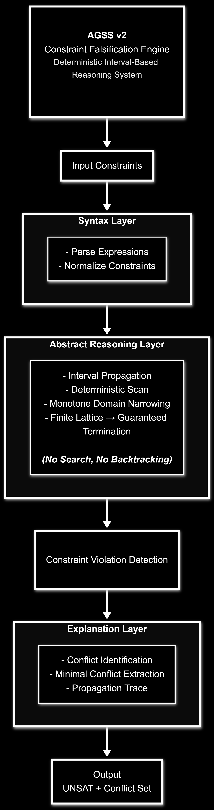

# AGSS v2 — Deterministic Constraint Falsification Engine

## What this system does
AGSS v2 is a deterministic reasoning engine for detecting contradictions in linear constraint systems.

It does not search for solutions.  
It proves that a set of constraints is inconsistent and identifies a minimal subset responsible for the contradiction.

The system operates using monotone interval propagation over a finite lattice, guaranteeing termination and deterministic behavior.

---

## Why this exists
Most constraint systems focus on solving or optimization. AGSS focuses on deterministic falsification and explanation. This makes it suitable for:

* **Model validation**
* **Debugging constraint systems**
* **Safety verification pipelines**
* **Auditable reasoning systems**

It is not intended to replace SMT solvers.

---

## Positioning
AGSS v2 is not a general-purpose solver. It complements SMT and constraint solvers by acting as a deterministic falsification layer focused on contradiction detection and explanation, rather than solution search or optimization.

---

## Architecture

AGSS v2 consists of three layers:

### 1. Syntax Layer
Transforms user expressions into canonical linear constraints.

### 2. Abstract Reasoning Layer
Performs interval-lattice propagation:
* **Monotone domain narrowing**
* **Deterministic full constraint scan**
* **No search or branching**

### 3. Explanation Layer
On contradiction:
* **Identifies constraints contributing to the contradiction**
* **Extracts a minimal conflict set via deterministic shrinking**
* **Produces propagation trace**

---

## Example

**Constraints:**
* $x + y \le 10$
* $x \ge 8$
* $y \ge 5$

**Propagation:**
* $x \in [8, +\infty]$
* $y \in [5, +\infty]$

**From constraint:** $x + y \le 10 \rightarrow \text{contradiction}$

**Result:** `UNSAT`  
**Conflict set:** `{x + y ≤ 10, x ≥ 8, y ≥ 5}`

---

## Formal Properties
* **Deterministic:** Same input $\rightarrow$ same result.
* **Monotone:** Domains only shrink.
* **Termination:** Finite lattice descent guarantees convergence.
* **Soundness:** If a contradiction is reported, the constraint system is unsatisfiable.

---

## Scope and Limitations

**AGSS v2 operates on:**
* Linear integer constraints
* Interval abstraction

**It does not support:**
* Search or backtracking
* Disjunction
* Optimization
* Full linear solving (e.g., simplex, elimination)

*Note: Contradictions requiring relational reasoning may not be detected.*

---

## Implementation
Core implementation is written in Rust. This repository exposes the system architecture, reasoning model, and examples. Full implementation details and optimizations are not publicly released. The reasoning model aligns with abstract interpretation and constraint propagation systems used in program analysis.

---

## System Boundary
AGSS v2 defines a constrained reasoning fragment based on interval abstraction and monotone propagation. More expressive reasoning (e.g., relational domains or search-based solving) requires extensions beyond this architecture.

---

## Summary
AGSS v2 is a deterministic constraint falsification engine designed for systems where:
* Reproducibility is required
* Explanations must be auditable
* Failure detection is more critical than solution finding

It provides a minimal, structured foundation for building reasoning and validation systems.